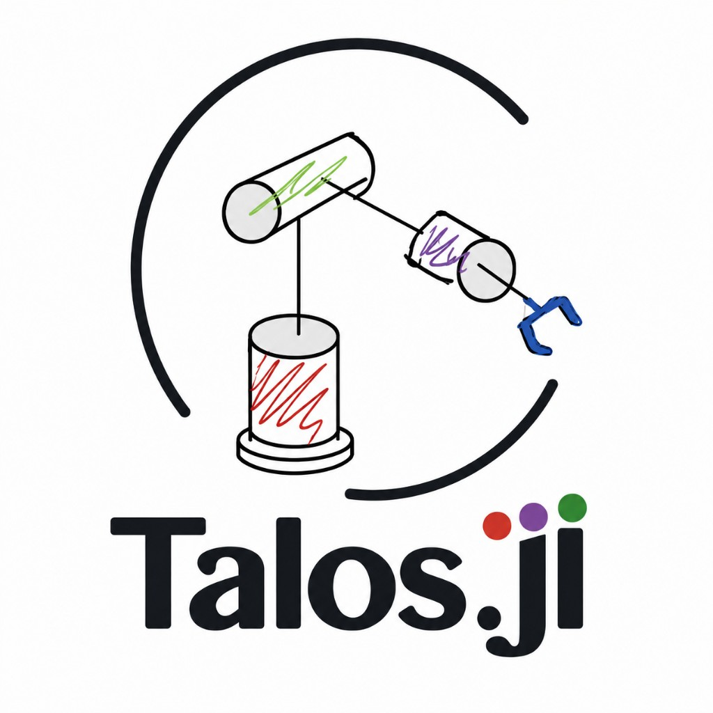

<p align="center">
  
</p>

<p align="center">
  <a href="https://github.com/kyma-un/JuliaRobTB/actions/workflows/CI.yml"></a>
  <a href="https://kyma-un.github.io/JuliaRobTB/dev"></a>
</p>

<p align="center">
  Transformaciones homogéneas y rotaciones para robótica en Julia.
</p>

## Quickstart

```julia
using Pkg
Pkg.add(url="https://github.com/kyma-un/Talos.jl")

using Talos
using StaticArrays

T = Se2(1.0, 2.0, π/2)
p = T * @SVector [1.0, 0.0, 1.0]

H = Se3(T)
q = H * @SVector [1.0, 0.0, 0.0, 1.0]

R = Rotz(90; deg=true)
```

Para dibujar el marco de `H`, carga un backend de Makie:

```julia
using GLMakie
trplot(H)
```

En un clon local:

```julia
using Pkg
Pkg.develop(path=".")
```
